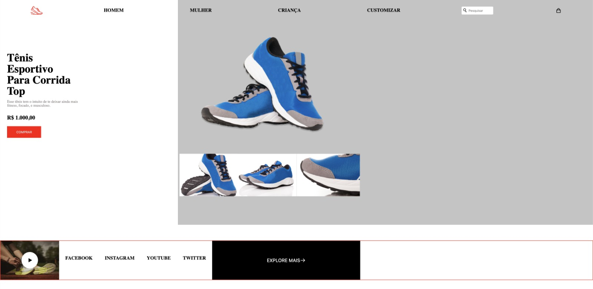

# Rocket Shoe

Language: 
  
  

Coding Laguage: 
  
  

Tools: 
  
  
  

  

## Descrição

Olá! E sejam muito bem vindos à primeira seção Hero! Este é um dos mais velhos projetos meus (Não espere muito em qualidade rsrsrs), este projeto foi sugerido e referido à mim, pela Rocketseat!

## Description

Hi! Welcome aboard down memory lane everyone! This on the other hand, is one of the first hero sections ever produced by me (you can tell because I haven't taken out the border lines I've used to measure stuff! lmao) Being one of my oldest projects ever developed (Don't expect much of it! lol), this project was suggested and refered for me, by Rocketseat!
